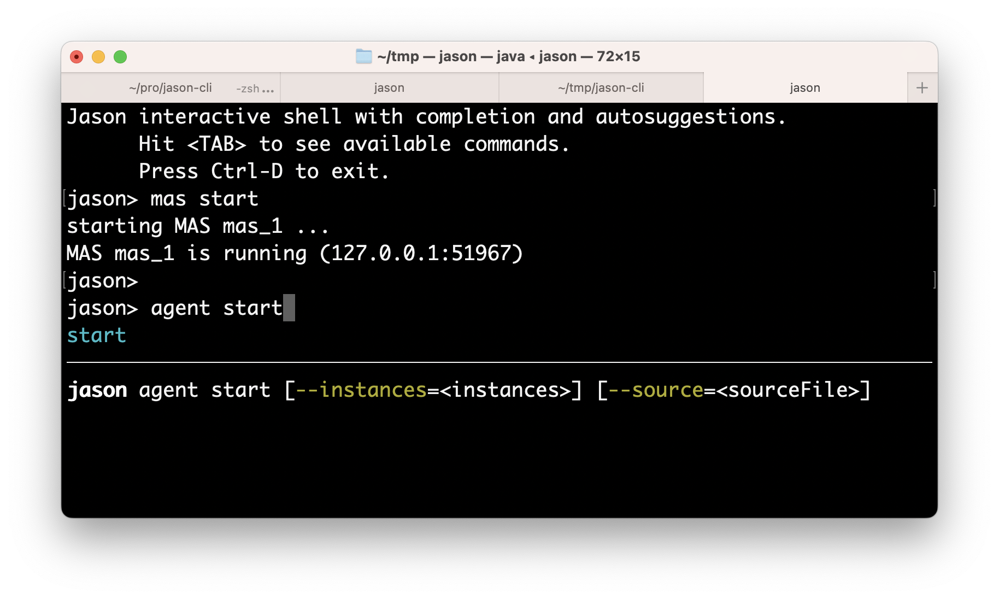

= Command Line Interface (CLI) for Jason
:toc: right

The Jason CLI is a command-line interface tool that you use to initialize, develop, and maintain Jason applications directly from a command shell at design and run time.


## Create Applications

New Jason applications can be created and executed with:

```
jason app create app1 --console
cd app1
jason app1.mas2j
```

The first command creates a Jason application identified by `app1` with two agents and a shared environment. The third command executes the application. The output:

```
[bob] hello world.
[alice] hello world.
```

You can add more agents in the project with:

```
jason app add-agent karlos
```
To run agent karlos, there are two options: stop the MAS and run it again; or add karlos in the running MAS:

```
jason agent start --source="src/agt/karlos.asl" --mas-name="app1" karlos
```

You can add a Gradle script for the application with:

```
jason app add-gradle
```

and then run it with `./gradlew run`.


More details and commands with:

```
jason app
```


Then use your preferred IDE to edit the sources of the application in  the `src` folder.

The commands of this section are used to help change the source code of some application. To change or monitor the state of running applications, see the commands below.


## Command Line

In your preferred terminal, you can start a new empty MAS with:

    $ jason mas start --console

In another terminal, you can start another MAS with:

    $ jason mas start m1

If you have an application with a `.mas2j` file, you can start it with:

    $ jason app.mas2j

Yet in another terminal:

    $ jason mas list
    $ jason mas stop m1 --exit

Agent commands:

    $ jason agent start  bob   --mas-name=mas_1
    $ echo "\!s. +\!s <- .send(bob,tell,hello)." > x.asl
    $ jason agent start  alice --mas-name=mas_1 --source=x.asl
    $ jason agent list         --mas-name=mas_1
    $ jason agent status bob   --mas-name=mas_1
    $ jason agent mind   bob   --mas-name=mas_1
    
    $ echo "+b <- .print(perceived(b))." > y.asl
    $ jason agent load-into alice --mas-name=mas_1 --source=y.asl
    $ jason agent mind alice   --mas-name=mas_1 --plans

## Interactive Shell

To open the Jason shell, simply executes `jason`: 

    $ jason
    Jason interactive shell with completion and autosuggestions.
      Hit <TAB> to see available commands.
      Press Ctrl-D to exit.
    jason>

the `<TAB>` key is your new 'mouse' to explore the system.

Example of use:

    jason> mas start
    jason> agent start bob
    jason> agent start alice {
        !start.
        +!start <- .send(bob,tell,hello).
    }
    jason> agent mind bob
        hello[source(alice)]
    jason> agent run-as bob { .send(alice,tell,hello) }
    jason> exit


In this example, 

* an (empty) MAS is created in the first command, 
* agent bob is created (second command) -- with no beliefs or plans; 
* agent alice is created (third command) -- with an initial goal and plan. 
* alice achieves the goal `!start` by sending a message to  bob
* the beliefs of bob are shown (fourth command). 
* bob also send a hello message to alice (fifth command).
* the MAS is finished (last command).

The shell provides completion and suggestions (using `<TAB>`).




## Scripts

Create a script file, for instance, a file called `hello.jcli` with content:

```
mas start

# starts bob with a plan
agent start bob    { +hello[source(A)] <- .print("hello from ",A). }

agent start alice
agent run-as alice { .send(bob,tell,hello) }  # alice executes the .send...

echo
echo "beliefs of Bob:"
agent mind bob         # show beliefs of bob
```

then  run it with

    $ jason < hello.jcli

the output in the _MAS Console_ will be:

```
[alice] done
[bob] hello from alice
```

and the output in the terminal is:

```
starting MAS mas_1 ...
MAS mas_1 is running (127.0.0.1:59052).
agent bob started.
agent alice started.
beliefs of Bob:
    hello[source(alice)]
<end of script>
```

(the list of all commands is xref:./commands.adoc[here].)
