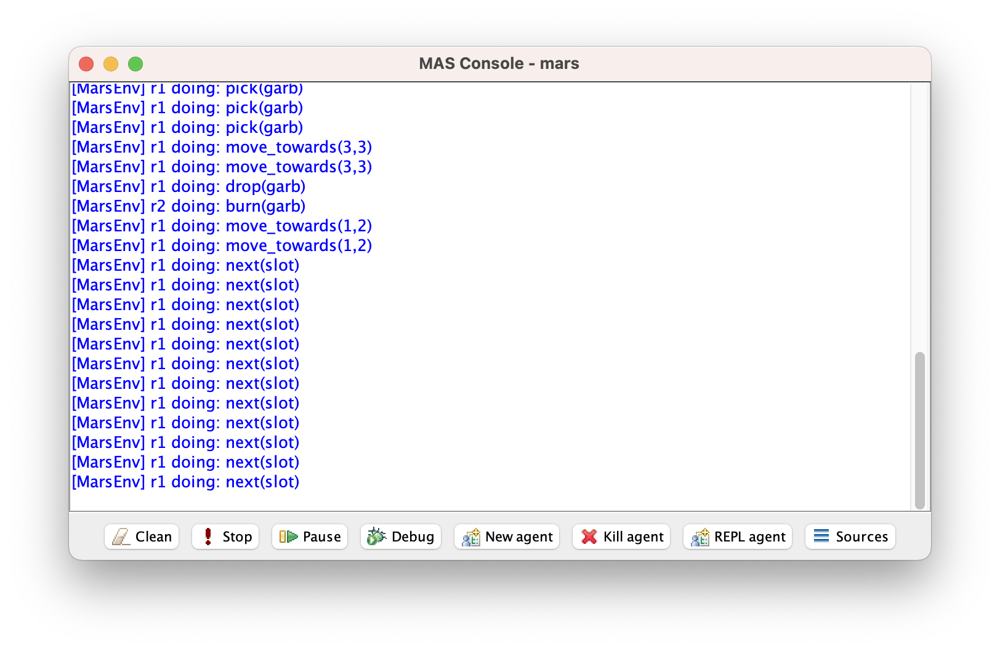

= Getting started with Jason
:toc: right
:source-highlighter: pygments
:pygments-style: jacamo
:pygments-linenums-mode: inline
:icons: font
:prewrap!:

This document aims to help you install and run Jason, as well as
developing a simple multi-agent system using Jason.

== Installation and Configuration

This tutorial uses VSCode + Jason. See xref:../vscode/readme.adoc[here] how to configure them.

== Execution of an example

Jason comes with many examples and demos. The examples are
multi-agent system applications for simple scenarios. The demos are
meant simply to show how to use some useful features of Jason. You
can find a brief description of examples and demos at
http://jason.sf.net.

We will now run the classic _Cleaning Robots_ example:

[quote]
This is a very simple example, showing a robot that searches the
  whole environment (represented as a grid) for pieces of garbage, and
  when one is found, it takes it to another robot, located in the
  centre of the grid, where there is an incinerator; the moving robot
  then goes back to the place where the last piece of garbage was
  found and continues the search from there. It is based on the
  original scenario that Anand Rao used when he introduced the
  AgentSpeak language.
+

All Jason projects have a configuration file that ends with
  `.mas2j`, so to open the cleaning robots example, open the
  folder `examples/cleaning-robots` in VSCode. You'll find
  in the folder where you installed Jason.

image:./figures/screen-mars.png[]

The project file defines the Java
  class that implements the environment (MarsEnv), and the agents that
  belong to this application (agent `r1` searches for pieces of garbage and
  `r2` incinerates them).

To execute this application, in the VSCode terminal, type 

----
jason mars.mas2j
----

Two windows are opened, the
  first is the application GUI and the second is the Jason MAS
  Console where all print messages are shown (MAS is a common
  abbreviation of _Multi-Agent Systems_).

To stop the MAS execution, click
  on image:./figures/suspend.png[] in the MAS Console.

== Creation of a simple example

In this section we will create a new and simple example where two
agents, `bob` and `alice`, exchange greeting messages.

- Create a new application called `greeting` with the command:
+
----
jason app create greeting
----

- Open the folder `greeting` in VSCode and you you notice the initial project is created with two agents already. 
+

- As you can see, there is a skeleton for the agent's code: the
  agent has no beliefs, but an initial goal `start` and one
  plan to achieve this goal. The plan simply prints something when
  triggered.
+

- We will now change agent `alice` 's code so that it sends a "`hello`"
  message to `bob`. To send messages, an *internal action*
  called `.send` is used:
+
[source,jasonagent]
.src/agt/alice.asl
----
!start.

+!start : true <- .send(bob,tell,hello).
----
+
In `bob` code, we remove the `start` goal (and its
  related plan), leaving its program empty:
+
[source,jasonagent]
.src/agt/bob.asl
----
// Agent bob in project greeting.mas2j
----

- You can now run the application.  There is no output! However, in
  the MAS Console, click on the debug
  button image:./figures/debug.gif[] and then select, in a new
  windows named _Jason Mind Inspector_ (also available at http://localhost:3272) the agent bob (if the
  agent's list is empty, click once in the run button). The mind
  inspector for `bob` will look as follows:
+
image:./figures/screen-mindinsp.png[]
+
Note the `bob` has a belief `hello[source(alice)]`,
  which means that it received alice's message.

- Suppose now that we want `bob` to react to this
  message. Since the received message implies a belief addition, an
  event like `+hello[source(alice)]` is produced and may trigger
  the execution of the following plan:
+
[source,jasonagent]
.src/agt/bob.asl
----
// Agent bob in project greeting.mas2j

+hello[source(A)] <- .print("I received a 'hello' from ",A).
----
+
In the plan, `A` is a variable that contains the name of the
  sender. In AgentSpeak, as in Prolog, identifiers that start with
  uppercase letters are variables.
+
When you run the new version, the output will be:
+
----
[bob] I received a 'hello' from alice
----

- Since `bob` is a polite agent, we will now make it send a
  hello back to `alice`:
+
[source,jasonagent]
.src/agt/bob.asl
----
+hello[source(A)]
  <- .print("I received a 'hello' from ",A);
     .send(A,tell,hello).
----
+
and `alice` does the same:
+
[source,jasonagent]
.src/agt/alice.asl
----
!start.

+!start : true <- .send(bob,tell,hello).

+hello[source(A)]
  <- .print("I receive an hello from ",A);
     .send(A,tell,hello).
----
+
Before running the system, think what you would expect to happen.
  Perhaps the agents will enter a kind of greeting loop?

- Run the system and you will realise that there is no loop!  The
  reason is because when bob receives the second hello, it already has
  this belief in its belief base (BB). Since nothing changed in the
  BB, no event was produced, and thus no plan triggered.

- If you want to use JADE as the infrastructure, execute the following commands:
+
----
jason app add-gradle
./gradlew runJade
----

== An example with environment

In this section we will create a system where one agent will perform
one action in a simulated environment.

- In the previous application, add one agent called `liz` with the following code:
+
----
jason app add-agent liz
----
+ 
then edit the code of the agent to:
+
[source,jasonagent]
.src/agt/liz.asl
----
// Agent liz in project testeenv.mas2j

!start.

+!start : true <- burn.
----
+
The plan's body has only the action, `burn`. Action here is
  meant to an *environment action* (i.e., something that changes
  the state of the environment), and not internal actions (the ones
  which starts with a dot, or have a dot anywhere in their name).

- The implementation of the `burn` action is done in an environment
  class. The project has an initial implementation of the environment in `src/env/example/Env.java`.
+
A skeleton for this class is added by Jason. Change it to be
  exactly as follows:
+
[source,java]
.src/env/example/Env.java
----
package example;

import jason.asSyntax.*;
import jason.environment.*;
import java.util.logging.*;

public class Env extends Environment {

  private Logger logger = Logger.getLogger("testenv.mas2j."+Env.class.getName());

  /** Called before the MAS execution with the args informed in .mas2j */
  @Override
  public void init(String[] args) {    }

  @Override
  public boolean executeAction(String agName, Structure action) {
    if (action.getFunctor().equals("burn")) {
      addPercept(Literal.parseLiteral("fire"));
      return true;
    } else {
      logger.info("executing: "+action+", but not implemented!");
      return false;
    }
  }

  /** Called before the end of MAS execution */
  @Override
  public void stop() {
    super.stop();
  }
}
----
+

When an agent attempts to execute an environment action, the method
  `executeAction` of this class is executed. In this
  implementation, if the action `burn` is executed, a new
  percept `fire` becomes available to all agents.

- Agent `liz` can now react to the perception of fire:
+
[source,jasonagent]
----
!start.

+!start : true <- burn.

+fire <- run.
----
+
(The implementation of the run action is left as an exercise.)

== Exercise

Imagine a very simple environment formed by 4 locations (identified by 1, 2, 3,
and 4) as in the figure below:

image:./figures/ambiente.png[]

A vacuum-cleaner robot should be programmed in AgentSpeak to maintain
the environment clean. The available actions for the robot are:

- `suck`: remove dirt at the robot's position;
- `left`: move the left;
- `right`: move to right;
- `up`: move up;
- `down`: move down.

To help the robot decide what action to take, the following percepts
are given:

- `dirty`: the robot is in a dirty location;
- `clean`: the robot is in a clean location;
- `pos(X)`: the location of the robot is X (0 < X < 5).

The following diagram, using the Prometheus notation, illustrates the
interactions between the robot and the environment.

An implementation of the environment class is available
link:./VacuumCleaning-1.zip[here].

*Some tips*

You can start programming your agent by thinking about how it should
react to the available perception. For instance, what it should do
when it perceives "dirty"? The action "suck", of course! In AgentSpeak,
we program this reaction by means of a plan as follows:

[source,jasonagent]
----
+dirty <- suck. // when dirty is perceived, do the action suck
----

So, an initial and very reactive agent can simply react to every
perception and be programmed as shown below (replace "someaction" for
the action you think is the most suitable, you might also want to
remove some of the plans):

[source,jasonagent]
----
+dirty  <- someaction.
+clean  <- someaction.
+pos(1) <- someaction.
+pos(2) <- someaction.
+pos(3) <- someaction.
+pos(4) <- someaction.
----

Since all perception is also included in the belief base, they can
also be used to select the right plan, as in the following example:

[source,jasonagent]
----
+pos(1) : clean <- someaction.   // whenever I perceive I'm in pos(1) and
                                 // I believe that my position is clean,
                                 // do some action.
----

You will soon realise that this reactive approach has some limitation
in defining a good behaviour for our vacuum cleaner. In fact, this agent
should be defined has having *goals*, in particular, a persistent
goal of maintaining the house clean. The easiest way to define a
persistent goal is by a recursive plan; for example, the code below
implements the persistent goal (represented by p) of printing out "a":

[source,jasonagent]
----
!p.                   // initial goal
+!p <- .print(a); !p. // to achieve the goal p, print "a"
                      // and after has p as a new goal.
----

Some comments on possible solutions for this exercise are available
link:./exercise-answers.txt[here].
//  send an email to mailto:jason.developers@gmail.com[] asking for the username and password required to download this file)

This document has shown a very limited range of Jason's features; the
next section contains references where you can find further
information.
