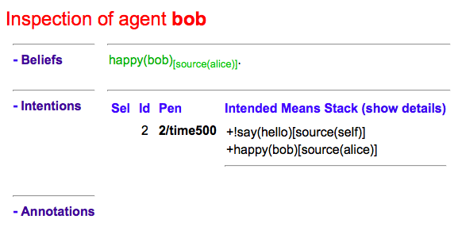
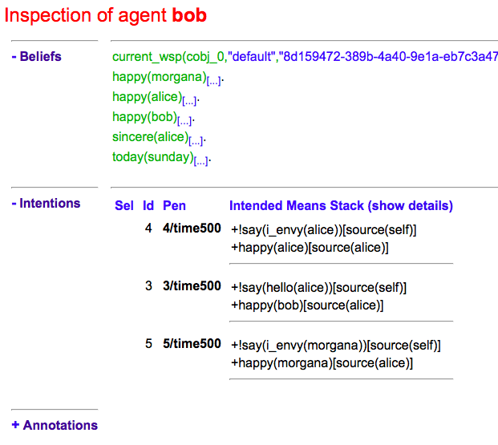

= (BDI) Hello World
Jomi F. Hubner (with Rafael H. Bordini support)
2015
:toc: right
:source-highlighter: pygments
:pygments-style: jacamo
:pygments-linenums-mode: inline
:icons: font
:prewrap!:

== Introduction

This programming (mini) tutorial illustrates how the BDI model is
used in the http://jason.sf.net[Jason] agent-oriented programming
language. We start by a very simple agent code and progress exploring
the BDI features of Jason.

We assume that the reader knows the basic concepts of the BDI model (an
introduction and further references are found at the
http://en.wikipedia.org/wiki/Belief–desire–intention_software_model[Wikipedia]).
It is important to know these concepts to be a good Jason programmer, in
the same way that knowing the concepts of and objects and classes is
important for a Java programmer. Very briefly, in the BDI model the
agent has _beliefs_ (based on what it perceives and communicates with
other agents) that can produce _desires_ (states of the world that the
agent wants to achieve). The agent _deliberates_ on its desires and
decides to _commit_ to some (desires to which the agent is committed
become _intentions_). To satisfy its intentions, the agent executes
plans that lead to action. The behaviour of the agent (i.e., its
actions) is thus explained/caused by what it intends (i.e., the desires
it decided to pursue). An important feature of architectures that
implement the BDI model is that the agent should _react_ to changes in
its environment as soon as possible while keeping its _pro-active_
(i.e., desires-oriented) behaviour. (Do not worry about all these
high-level anthropomorphic concepts (in _italics_), we will try to keep
the simplicity of usual hello world programs.)

== Bob (the mentalist)

=== Agent program

The Jason program for our agent is the following (since BDI is inspired
in folk psychology, we can name this agent Bob):

[source,jasonagent]
-----------------------------------
happy(bob).

!say(hello).

+!say(X) : happy(bob) <- .print(X).
-----------------------------------

As we can see, the syntax is far from the usual C, Java, or Python
programs we are used to. For those (rare) guys who have had some contact
with Prolog, maybe it looks a bit familiar. The syntax is indeed
inspired by Prolog, but the objective is different (the output is not
knowledge and the underlying engine is not based on resolution). Let's
read this program:

.  The agent has one (initial) belief: `happy(bob)`, included by the
programmer (rather than by perceiving the state of the environment).
This belief can be read as "`bob has the property (or predicate) _happy_`".
.  The agent has one (initial) desire: `!say(hello)`, also included by
the programmer. What follows the symbol `!` describes the desire and is
also represented as a Prolog literal.
.  The agent has one plan to achieve the desire `say(hello)`. We can
read this plan as "`whenever the agent has the desire to `say(X)` and
believes that `happy(bob)`, by executing the action `.print(X)` the
desire is achieved, for any `X` (which is a variable since it starts
with an uppercase letter, as in Prolog)`".

The _deliberation_ process of the BDI model is highly related to plans.
The plan states _whether_ a desire can become an intention by means of
its _event_ and _context_. In the Bob's plan, the event is `+!say(X)`
(what is written before `:`) and it means the event of having a new
desire to say something. The context is `happy(bob)` (the part of the
code that goes between `:` and `<-`) which is a logical formula
evaluated in regards to the current believes of the agent.

The plan also states _how_ to achieve the desire (i.e. the _means-end_
reasoning part of the BDI model). If the sequence of actions (after
`<-`) is successfully executed, the desire is (hopefully) achieved. An
intention in Jason is an instantiated plan that the agent is executing
in order to achieve a desire (also called goal).

This program is interpreted by Jason as follows:

1.  The initial belief is added in the agent belief base (BB).
2.  From the initial desire, the event `+!say(hello)` is added in the
queue of events to be handled by the agent.
3.  The plan is included in the plan library (PL) of the agent.
4.  A reasoning cycle loop is executed:
* The event `+!say(hello)` is selected from the queue.
* The above plan is selected (it matches the selected event when the
variable `X` is bound to `hello`).
* The context of the plan is evaluated as true since it follows from be
BB (i.e. the agent believes `happy(bob)`).
* A new intention is created based on this plan and the `X` value. The
agent has thus committed itself to the desire to `say(hello)`.
* One action of the intention is executed (the `.print(hello)` command
in this case).
* Since the intention has executed all actions, it finishes.
5.  The agent keeps waiting for new events to react to.

=== Execution

* Create a new project: you can link:./hello-bdi-code.zip[download] and initial JaCaMo project;
  or create a new one Jason application with JasonCLI: `jason app create bdi_hw`.
* Create agent Bob with the source code above (file `bob.asl`). The project should
look like:
+
[cols="2",frame=topbot]
|===
|Jason .mas2j project|JaCaMo .jcm project

a|
[source,jasonproject]
----------------
MAS bdi_hw {

    agents: bob;

}
----------------

a|
[source,jacamoproject]
----------------
mas bdi_hw {

    agent bob
    // file bob.asl at src/agt under the project directory

}
----------------

|===

* Run the project. In the case of JaCaMo, run the script `./gradlew`; in case of Jason `jason bdi_hw.mas2j`.

=== Exercises A

1. Add a new goal for Bob: `say(bonjour)`.
2. Add the following beliefs for Bob:
+
[source,jasonagent]
----------------
msg(en,"Hello").
msg(fr,"Bonjour").
msg(pt,"Ola").
----------------
and change the plan for the goal `say` so that the argument is the language and the message is based on the above beliefs. For instance the goal `!say(fr)` prints out `Bonjour`.

== Bob (the believer)

The second version of agent Bob has neither initial beliefs nor desires:

[source,jasonagent]
---------------------------------------------------------------
+happy(bob) <- !say(hello).
+!say(X) : not today(monday) <- .print(X); .wait(500); !say(X).
---------------------------------------------------------------

The first plan has a different kind of event: the agent has started to
believe something (the belief that follows `+`). So when the agent
starts believing that Bob is happy, the desire to say hello
(`!say(hello)`) is created. In this case, the desire is the result of
changes in the agent's beliefs. The agent starts believing something
when, for instance, it perceives the state of the environment or
receives a message from another agent.

The second plan has also changed: (i) the agent will decide to pursue
the desire to say something on days other than Monday; (ii) after
printing the message, the desire is kept, producing a loop that will end
on the next Monday. In other words, the intention to achieve `!say` does
not finish because that intention itself creates a new desire `!say`
(here also conveniently called sub-goal). Only when this sub-goal is
achieved, the intention finishes (which never happens in the above
plan).

If you run this program, nothing happens! Different from other languages
where the programmer defines a sequence of operations, in Jason the
programmer _declares_ plans and the order of execution depends on the
order of the events that take place on a particular environment.

To interact with Bob, we will create another agent at runtime that informs him
about new facts.

1.  Run the project.
2.  In the MAS Console, click on the button "New REPL agent" and fill
"alice" as the name of the new agent.
3.  In the Alice interface, enter `.send(bob,tell,happy(bob))`.
4.  You will notice that Bob starts saying hello.

The _tell_ message that Alice sent to Bob is automatically interpreted
by Jason. The default interpretation, since it is a "tell" message, is
to include the content of the message (`happy(bob)`) in the Bob's belief
base. When that belief is added in the belief base, the event
`+happy(bob)` is included in the queue of events. Bob then reacts to
this event creating an intention. You can access the
http://localhost:3272[Jason Mind Inspector] to see the Bob's mental
state (or use the Debug button in the MAS Console):

As we can see, the belief is not exactly `happy(bob)` but
`happy(bob)[source(alice)]`. The part enclosed by `[` and `]` are
annotations. All beliefs in Jason have annotations for their sources.
This information can be used, for instance, if an agent needs to
consider only those beliefs that come from trustable sources:

[source,jasonagent]
---------------------------------------------------------------
sincere(alice).

+happy(bob)[source(A)] : sincere(A) <- !say(hello(A)).

+!say(X) : not today(monday) <- .print(X); .wait(500); !say(X).
---------------------------------------------------------------

This program has a problem, however. Another malicious agent can tell
Bob that it is sincere just before telling him `happy(bob)`! The source
of the `sincere` belief should be Bob itself (and not another agent):

[source,jasonagent]
-----------------------------------------------------------------
sincere(alice).

+happy(bob)[source(A)] : sincere(A)[source(self)] <- !say(hello(A)).

+!say(X) : not today(monday) <- .print(X); .wait(500); !say(X).
-----------------------------------------------------------------

=== Exercises B

Using the REPL interface, create a third agent called `marcos` that runs `.send(bob,tell,happy(bob))`.

1. How is the belief base of Bob?
2. How many intentions Bob has? Why?
3. Add the belief `sincere(marcos)` for Bob and run the exercises 1 and 2 again.
4. Create a fourth agent, called `john` that runs `.send(bob,achieve,say(kkk))`. What can you infer from the `achieve` performative used in this message?

=== Perception

Besides messages from other agents, another source for beliefs is
perception. We will place a calendar in the environment so that Bob can
be aware of the current day. It is not the focus of this tutorial to
develop the environment, so we will simply copy & paste some code:

* change the project to:
+
[cols="2",frame=topbot]
|===
|Jason .mas2j project|JaCaMo .jcm project

a|
[source,jasonproject]
--------------------------
MAS bdi_hw {

  // CArtAgO environment
  environment: jaca.CartagoEnvironment

  // Agent architecture for CArtAgO
  agents:
     bob agentArchClass jaca.CAgentArch;
}
--------------------------

a|
[source,jacamoproject]
--------------------------
mas bdi_hw {

   agent bob

   workspace world {
      artifact cal: Calendar {
         focused-by: bob
      }
   }
}
--------------------------
|===

* Download link:./code/Calendar.java[this] file and place it in the
directory of the project where artifacts go (when using JaCaMo, this directory usually is `src/env`)
* In the beginning of Bob's program (`bob.asl`), add the following lines to give him access to the calendar:
+
[cols="2",frame=topbot]
|===
|If using .mas2j project|If using .jcm project

a|
[source,jasonagent]
---------------------------------------------------------------------
!create_calendar.
+!create_calendar
   <- makeArtifact("c","Calendar",[],AId);
      focus(AId).
---------------------------------------------------------------------

a|
[source,jasonagent]
--------------------------
{ include("$jacamoJar/templates/common-cartago.asl") }
--------------------------
|===

* Run the project and interactively change the current day observing
Bob's belief base and intentions. For example, if you change the day to
Monday, the intention will finish. In this case, the intention finishes
with failure, since the agent has a desire without a suitable plan.

=== Exercises C

1. Change the Bob's program so that no failure is produced on Mondays, but a proper message is printed.

== Bob (the vigilant)

The following program for Bob includes alternative plans for the events
`+happy(H)` and `+!say(X)`.

[source,jasonagent]
-----
sincere(alice).

+happy(H)[source(A)] : sincere(A)[source(self)] & .my_name(H) <- !say(hello(A)).
+happy(H)            : not .my_name(H)                        <- !say(i_envy(H)).

+!say(X) : today(friday)     <- .print(X,"!!!!!"); .wait(math.random(400)+100); !say(X).
+!say(X) : not today(monday) <- .print(X);         .wait(math.random(400)+100); !say(X).
+!say(X)					 <- !say(X).
-----

For each event, *one* plan is selected according to the context: the
first plan with a context that holds is selected to create the intention
to react to the event.

The first plan for `+happy(H)` is used when `H` is `bob` and the source
of `happy(H)` is sincere
(http://jason.sourceforge.net/api/jason/stdlib/my_name.html[`.my_name`]
is true if the value of `H` is the name of the agent executing that
internal action). The second plan is used otherwise. The first plan for
`+!say(X)` is used on Fridays and the second on days other than Monday.
(Notice that there is a plan for Mondays that does not actually say anything
but just keeps the intention alive. Without it Bob would find no plan for
`say(X)` on Monday and the goal for `say(X)` would not be re-added. Thus, Bob
would remain mute thereafter.)

Instead of using REPL, we will add a new agent, called Alice, to run
this system. The program for Alice is bellow (in a file named `alice.asl`).

[source,jasonagent]
-------------------------------------
!start.

+!start
   <- .send(bob,tell,happy(bob));
      .send(bob,tell,happy(alice));
      .wait(2000);
      .send(bob,tell,happy(morgana)).
-------------------------------------

The project file has to be updated:
[cols="2",frame=topbot]
|===
|Jason .mas2j project|JaCaMo .jcm project

a|
[source,jasonproject]
--------------------------
MAS bdi_hw {

  environment: jaca.CartagoEnvironment

  agents:
     bob agentArchClass jaca.CAgentArch;

     alice; // new agent
}
--------------------------

a|
[source,jacamoproject]
--------------------------
mas bdi_hw {

   agent bob

   agent alice // new agent

   workspace world {
      artifact cal: Calendar {
         focused-by: bob
      }
   }
}
--------------------------
|===

When running this new application, we can notice how many intentions Bob has now:

Bob is concurrently executing three intentions: one for each event. More
importantly, even with 3 intentions (or 100 intentions) Bob promptly
reacts to new events. This _reactivity_ is indeed one of the nicer
features of the BDI model. You can test it by creating a new REPL agent
that sends tell messages to Bob and see how fast it reacts.

To really stress Bob, we can change Alice's program as follows:

[source,jasonagent]
-------------------------------------
!start.

+!start
   <- .send(bob,tell,happy(bob));
      .send(bob,tell,happy(alice));
      .wait(2000);
      .send(bob,tell,happy(morgana));
      for (.range(I,1,100)) {
         .send(bob,tell,happy(I));
      }.
-------------------------------------

At this point of the tutorial, you could try to imagine how to program
this application using conventional languages like Java and C. Even
actor-based languages, which are also oriented to events and great tools
for concurrency, may not be as simple as Jason.

=== Exercises D

1. Add the agent Carlos from previous exercise in the project.
2. Write a plan for Bob so that as soon as it realises that someone is happy, he shares this information with Carlos.
3. What happens in the application when Carlos executes `.send(bob,tell,happy(thales))`?

== Bob (the revisionist)

Another important feature of the BDI model is that agents are able to
revise their own intentions. The following plan reacts to the event of
stop believing that someone is happy. The reaction is to drop the
corresponding intention.

[source,jasonagent]
--------------------------------------
// new plan in Bob's program:

-happy(H)[source(A)]
   <- .drop_intention(say(hello(A)));
      .drop_intention(say(i_envy(H))).
--------------------------------------

We can test this with the following program for Alice:

[source,jasonagent]
---------------------------------------------------
!start.

+!start
   <- .send(bob,tell,happy(bob));
      .send(bob,tell,happy(alice));    .wait(2000);
      .send(bob,tell,happy(morgana));  .wait(2000);
      .send(bob,untell,happy(bob));    .wait(1000);
      .send(bob,untell,happy(alice)).
---------------------------------------------------

The `untell` message removes the corresponding belief in the receiver
(only for the belief with that same source, of course).

=== Exercises E

1. Write a new plan for Bob so that on Saturdays he drops all his intentions. The internal action http://jason.sourceforge.net/api/jason/stdlib/drop_all_intentions.html[`.drop_all_intentions`] may help for that.
2. Write a plan for Bob so that as soon as it realises that someone is happy, he shares this information with Carlos *only* if Bob intends to `say(hello(carlos))`. The internal action http://jason.sourceforge.net/api/jason/stdlib/intend.html[`.intend`] may help for that.

== Bob (the lazy -- finally)

This last code for Bob implements the following:

1.  On Wednesdays, Bob keeps only two `say` intentions, the others will
be suspended.
2.  On Fridays, suspended intentions are resumed.
3.  On Saturdays, all intentions are dropped.

[source,jasonagent]
-----
sincere(alice).

+happy(H)[source(A)] : sincere(A)[source(self)] & .my_name(H) <- !say(hello(A)).
+happy(H)            : not .my_name(H)                        <- !say(i_envy(H)).

-happy(H)[source(A)]
   <- .drop_intention(say(hello(A)));
      .drop_intention(say(i_envy(H))).

+!say(X) : today(friday)     <- .print(X,"!!!!!"); .wait(500); !say(X).
+!say(X) : not today(monday) <- .print(X);         .wait(math.random(400)+100); !say(X).
+!say(X)					 <- !say(X).

/**** the following is NEW ****/

+today(wednesday) <- .print("**** Let's slow down.... ****"); !enter_lazy_mode.
+today(friday)    <- .print("**** Let's finish the work!");   !resume_all.
+today(saturday)  <- .print("**** weekend!");                 .drop_all_intentions.

+!enter_lazy_mode
    : .findall(A, .intend(say(A)), [_,_|L]) // the agent has at most two active "say" intentions
   <- for ( .member(I,L) ) {
         .suspend(say(I));
      }.
+!enter_lazy_mode.

+!resume_all
    : .count( .intend(A) & .suspended(A,R) & .substring("suspended",R), I) & I > 0
   <- .resume(say(_));
      !resume_all.
+!resume_all.
-----

(You can refer to the
http://jason.sourceforge.net/api/jason/stdlib/package-summary.html#package.description[Jason
API] for explanations about all the commands used in this example.)

This tutorial showed how some of the (great) BDI concepts become
concrete and practical in Jason, particularly long-term intentions and
reactivity.

'''''
