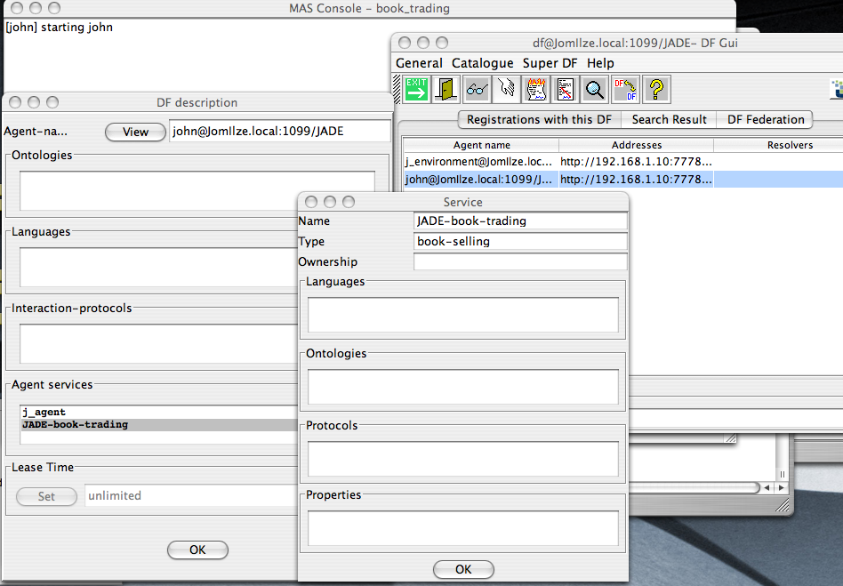

= Interoperation between Jason and JADE
:toc: right
:source-highlighter: pygments
:pygments-style: jacamo
:pygments-linenums-mode: inline
:icons: font
:prewrap!:

ifdef::env-github[:outfilesuffix: .adoc]

NOTE: This tutorial is not update for Jason 3.2, where Gradle is used to run Jade and not `.mas2j`. But the general idea remains. If you would like to see this tutorial updated, add an issue at GitHub.

This document aims to show how to create Jason agents that
participate in a multi-agent system (MAS) formed by "`normal`" JADE
agents (by normal we mean being not developed considering
interoperability with Jason). We will
develop a Jason book-seller agent that joins the system of the
traditional example of book trading that comes with JADE. The JADE
code will remain as in the example, it will not be changed to
interoperate with Jason.

== Accessing the JADE DF

The first thing a seller agent should do is to register itself as a
book seller in the JADE DF (Directory Facilitator) service.

The following steps create a new Jason project for our seller agent:

- Create a new project called "`book_trading`" that uses Jade as
  the infrastructure.
+
image:./figures/screen-create-project.png[]

- Create the first version of the seller agent, called
  `john`, with the following code:
+
[source,jasonagent]
.john.asl
----
/* Initial beliefs and rules */

// A 'book' belief has three arguments:
//   . the title
//   . its price
//   . the quantity in stock

book("Harry", 32, 20).
book("Jason", 50, 10).

/* Initial goals */

!registerDF.

/* Plans */

+!registerDF <- .df_register("JADE-book-trading", "book-selling"). // name, type
----
+
- You can now run the project and use the menu option Tools ->
  Show DF of the RMA agent to inspect the DF:

== Creating a seller in Jason

The buyer agent, written in JADE, retrieves information about all
sellers from the DF, and then sends a CFP (call for proposal) message
to all those agents. Since Jason agents use KQML-like performatives,
the performatives used by JADE agents are not available in Jason,
i.e., the semantics of those performatives are not implemented in
Jason (which implements the semantics of performatives such as tell,
askOne, achieve, etc.). We need therefore to write "`low level`" plans
to handle in AgentSpeak the CFP messages from JADE agents.

Every message that arrives in to Jason agent (and is accepted for
processing) produces an event like `+!kqml_received(Sender, Performative, Content, MsgId)` (the MsgId should be used to reply to
the message). We can then create plans to handle this event in the
particular case where the performative is CFP or ACCEPT_PROPOSAL:

[source,jasonagent]
.john.asl
----
include::book_trading/john.asl[]
----

== Running the system

Follow the steps below to run the system with JADE and Jason agents:

- Start the JADE main container and the seller agent using the
  image:./figures/run.png[] button in jEdit.

- Download the buyer agent from
  link:./jade-example.zip[here]. (It is distributed as an example of
  JADE)

- Compile the JADE examples
----
export CLASSPATH=~/jason/libs/jade-XXXX.jar:.  <1>
cd jade-example
javac examples/bookTrading/Book*.java
----
<1> Where XXXX is the release of Jade in the `libs` folder and `~/jason` is where Jason was installed.

- Start the buyer, called `bob`, in a new container using
  the command
----
java jade.Boot -container -host localhost "bob:examples.bookTrading.BookBuyerAgent(Harry)"
----

It will try to buy a book entitled "`Harry`".

The output from the buyer is:
----
Hallo! Buyer-agent bob@JomIlze.local:1099/JADE is ready.
Target book is Harry
Trying to buy Harry
Found the following seller agents:
john@JomIlze.local:1099/JADE
Harry successfully purchased from agent john@JomIlze.local:1099/JADE
Price = 32
Buyer-agent bob@JomIlze.local:1099/JADE terminating.
----

You can also run the whole system without jEdit:

- First start the buyer in the main container:
----
java jade.Boot -gui "bob:examples.bookTrading.BookBuyerAgent(Harry)"

----
- Start the Jason seller as follows (ensure that all JADE jars
  are in the CLASSPATH):
----
cd <directory where the book_trading example was saved>
export CLASSPATH=$CLASSPATH:bin/classes
java jade.Boot -container -host localhost "john:jason.infra.jade.JadeAgArch(john.asl)"
----

The overall process of launching distributed agents can be simplified
by the Ant script created by Jason as explained in the
http://jason.sf.net/faq[FAQ].

== Exercises

- Run the agents in different machines.
- Write the code for a buyer agent in Jason that uses the DF to
  find sellers, sends a CFP, select the cheapest, and only then buys
  the book.
