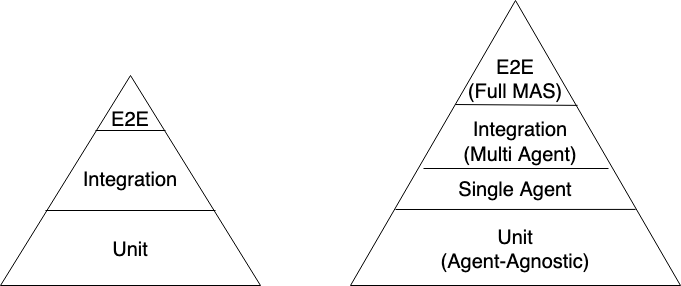
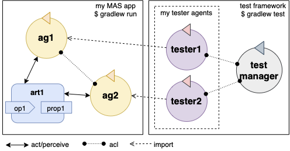

= Goal-Oriented Test-Driven Development with Jason
:toc: right
:source-highlighter: pygments
:pygments-style: jacamo
:pygments-linenums-mode: inline
:icons: font
:prewrap!:

ifdef::env-github[:outfilesuffix: .adoc]

This document explains how to test Jason agents in AgentSpeak, using a novel (as of 2021)
goal-oriented test feature that enables an agent-oriented perspective on automated software testing
and test-driven development. The feature allows writing test programs for Jason agents in
AgentSpeak, and aligns software testing and agent-oriented programming abstractions. This
consolidation of perspectives is called _Goal-Oriented Test-Driven Development_ (GOTDD).

== What is Goal-Oriented Test-Driven Development?
In modern software development, testing plays a key role, as it helps ensure the software works as
expected. Ideally, developers use _Test-Driven Development_ (TDD) approaches, in which at large
portion of the tests is written during or even ahead of the implementation of the actual program
code. The assumption is that specifying the exact desired behavior of a software component _before_
implementing this component facilitates for a more rigorous assessment of the component and ensures
testing is not cut short because of time shortage caused by mis-estimations. Generally, it is
considered good practice to focus automated testing efforts on _unit tests_ of small components that
can and hence _should_ be tested in a rigorous manner and to cover the overall system (or system of
systems) with less dense _integration tests_ and _End-to-End_ (E2E) tests; the latter cannot cover
all possible input and environment configurations because of the explosion in combinatorial options,
even fairly small systems, but they can potentially catch unexpected behavior of components that
seemingly work correctly from a lower-level perspective.

From an agent-oriented perspective, unit tests cover behavior that is _agent-agnostic_, _i.e._ which can be tested as if it was a function/method call, for example given the internal state the agent, and which is disconnected from the state of the environment and the other agents that (inter)act in it. While unit tests for agents are conceptually
not different from traditional unit tests, Jason's GOTDD feature is novel even on this level because
it provides first-class abstractions for tests in an agent-oriente programming language. Still, more
interestingly, Jason allows for the specification of tests that check whether an agent, given an
initial environment state (and potentially given other agents), will eventually (or given a specific
time constraint) achieve a particular _goal_; _i.e._, goals are promoted to first-class abstractions
for test-driven development, which allows for integration tests for single agents (agent-environment
integration) and multi agents (agent-environment-agent, whereby the environment may or may not 
contain explicitly modelled artifacts) integration. The figure below shows the _test pyramid_ from a
traditional software engineering perspective and contrasts it with an agent-oriented test pyramid.

The tutorial below provides examples of unit testing, single agent testing, and multi-agent testing
with Jason; the examples are real-world tests that help assure the quality of the Jason project's
code base, but have been extracted into an minimal project to make it easier to explore the feature.
Note that E2E tests are not covered, because these are typically implemented in a different
technology ecosystem (for example: _Selenium_ for end-to-end user interface testing).

== Under the Hood
Under the hood, Jason's GOTDD feature allows for the instantiation of one main agent per test file,
as well as for the instantiation of several _mock agents_; in addition to mock agents, the main
(to-be-tested) agent may interact with other agents that have been implemented in a traditional
manner. The main agent is monitored by Jason's tester agent with regards to the main agent's ability
to achieve certain goals, or the agent's internal state (for example: belief adoption). Whenever
a corresponding assertion fires, the tester agent reports the result (pass or fail). 

== Test Levels in Jason
Now, let us provide examples how tests on the three lower levels (_unit_, _single agent_, _multi agent_, assuming that end-to-end tests need to be supported by additional tooling) work.

=== Project Setup
Let us set up our Jason project and configure it for GOTDD.

1. First, we take the content of the boilerplate test configuration file from link:https://github.com/jason-lang/jason/blob/master/src/test/jason/unit_tests_project.mas2j[here] and copy it in a file called _tdd.mas2j_ (which we create in our project's root directory).

[source]
MAS tdd {
    infrastructure: Centralised
    agents:
        test_manager [
            goals="create_tester_agents(\"./src/test/jason\",\".*.asl\")",
            beliefs="shutdown_delay(600)"
        ];
    aslSourcePath:  "src/test/jason/inc";
                    "src/test/jason/asl";
                    "src/asl";
                    "src/agt";
                    "inc";
                    "$jasonJar/test/jason/inc";
}

Then, we create the directory structure for our project:

[source]
/
- main
    - jason
        - asl
- test
    - jason
        - asl

=== Unit Testing in Jason
Let us start by implementing a simple 

=== Single Agent Testing in Jason

=== Multi-Agent Testing in Jason

== Conclusion
This tutorial has provided a brief overview of how to test Jason agents directly in AgentSpeak, as
well as of the conceptual benefits goal-oriented test-driven development provides for the
development of multi-agent systems.
