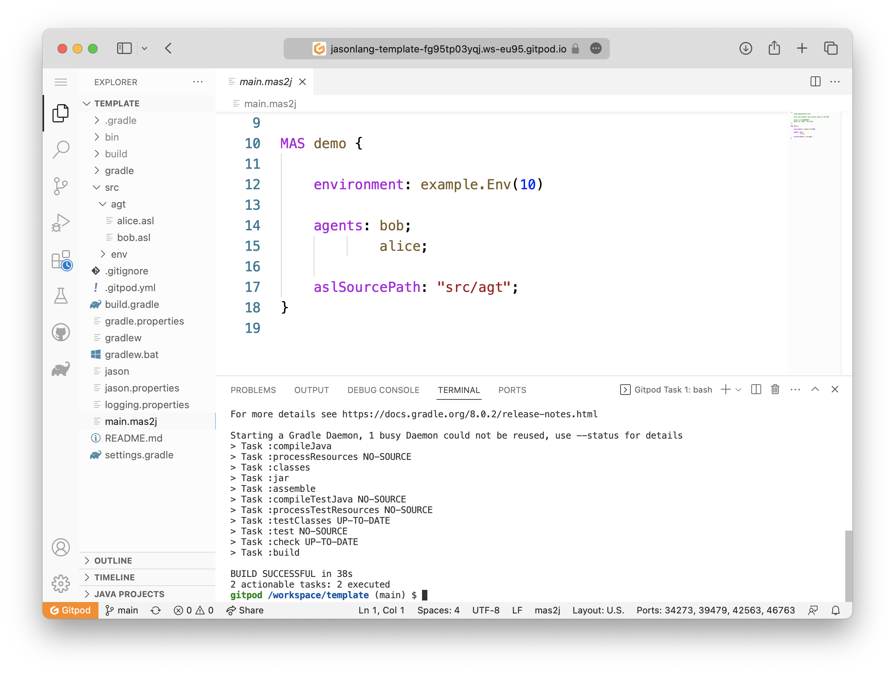
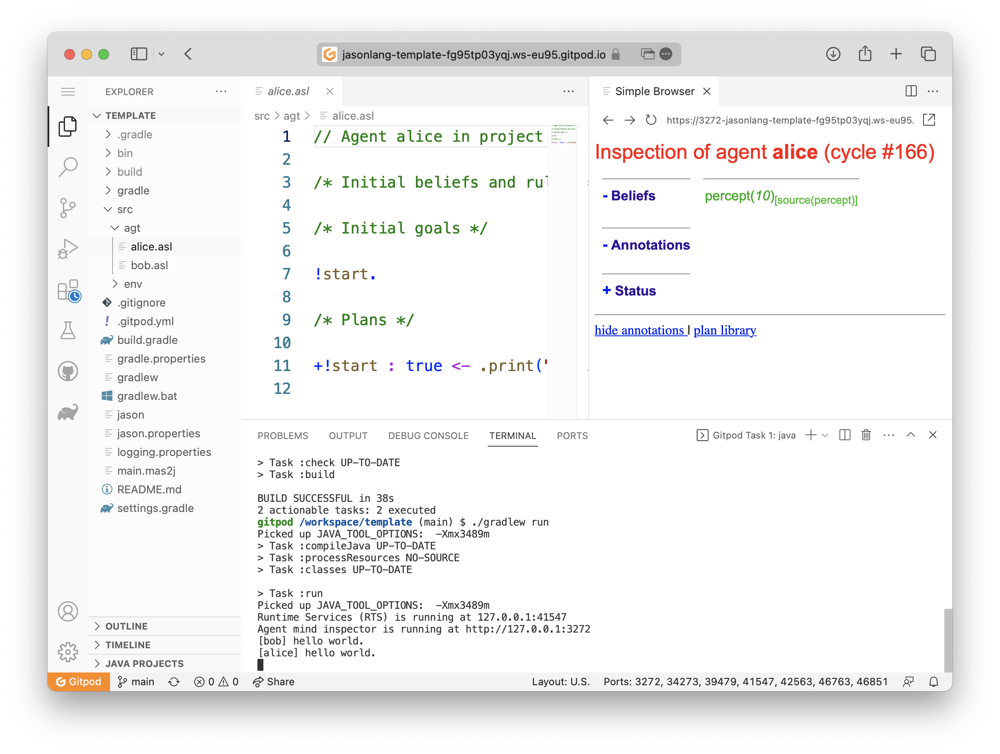

= VSCode Browser (Web) as an IDE for Jason
:toc: right
:date: April 2023
:source-highlighter: coderay
:coderay-linenums-mode: inline
:icons: font
:prewrap!:

== What You Will Build

In this document, you will build a *web* environment to develop agent-based system with link:https://github.com/jason-lang/jason[Jason] language.

== Requirements

- A GitHub account
- A browser (Chrome and Safari works fine) 

== Steps for GitPod

This IDE uses https://gitpod.io[GitPod], so you will be asked to allow it to access your GitHub account.

1. Open GitPod with the following https://gitpod.io/#https://github.com/jason-lang/template[link]. 
2. Register (or login) and then create a new workspace with the recommended settings.
3. Wait the initialization.
4. Open the `main.mas2j` file and you will get the same result as in the picture below

Run the MAS with the command `./gradlew run` in the terminal.

== Steps for GitHub CodeSpace

1. Go the link:https://github.com/jason-lang/template[Jason Template project]

2. Click on "use this template" and then "open in a codespace":

Run the MAS with the command `./gradlew run` in the terminal.

