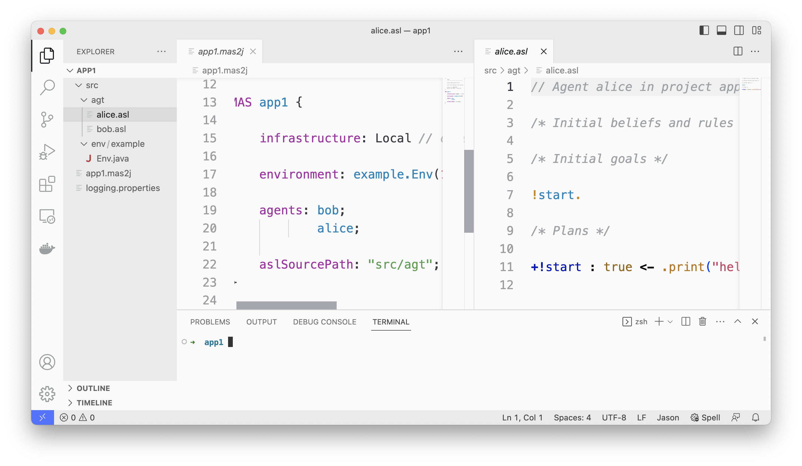

= VSCode as an IDE for Jason
:toc: right
:date: March 2023
:source-highlighter: coderay
:coderay-linenums-mode: inline
:icons: font
:prewrap!:

== What You Will Build

In this document, you will build an environment to develop agent-based system with link:https://github.com/jason-lang/jason[Jason] language.

include::../../install.adoc[]

//

== Create and run a new application

In a terminal, you can create a new Jason application, named `app1`, with the following command:

----
jason app create app1
----

A folder `app1` is created for the application. Now you  can open it with VSCode:

It has two agents (bob and alice) sharing a common environment. The code of the agents are in `src/agt`. The code of the environment is in `src/env`.

It would be useful to install a VSCode plugin that provides link:https://marketplace.visualstudio.com/items?itemName=tabajara-krausburg.jacamo4code[syntax highlight] for Jason.

You can execute the application with

----
cd app1
jason app1.mas2j -v
----

The two agents print a hello world message. 

NOTE: The first time you run a Jason application, it may take a while to start, since Gradle is being used and it downloads all dependencies.

You can now change the code of your application and evolve the code of your agents.

Just as an example, change the code of `alice.asl` to

----
!start.

+!start <- .send(bob,tell,hello).
----

executes the system again, open the link:http://127.0.0.1:3272[mind inspector], and see bob's beliefs.

== More on Jason CLI

To add more agents in your project:

----
jason app add-agent karlos
----

More commands for the application are shown with

----
jason app 
----

and commands to monitor/control running applications with 

----
jason mas
----

More about JasonCLI xref:../../jason-cli/readme.adoc[here].
